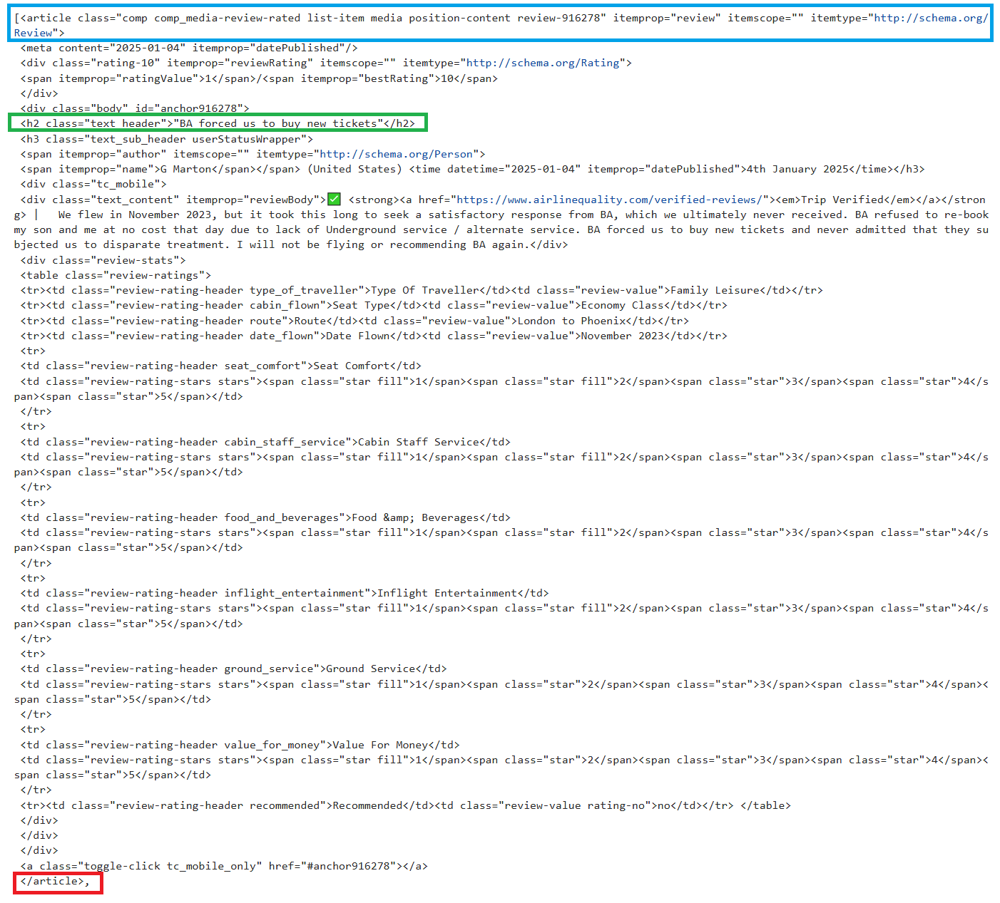

# Sentiment Analysis (British Airways Data Science Project Part 1)

## Introduction
This is Part 1 of a project from the [British Airways Data Science micro-internship](https://www.theforage.com/simulations/british-airways/data-science-yqoz). British Airways is the flag carrier airline of the United Kingdom and is the second largest UK based carrier based on fleet size and passengers. British Airways has merged with Iberia, Spain's flag carrier airline, creating the International Airlines Group.

In this task, I take on the role of a junior data scientist employed at British Airways. British Airways has tasked me with collecting customer feedback and reviewing data from a third party source. I am also tasked with creating a predictive model to help determine which customers will book a flight for the upcoming holidays. **In this part of the project, I will collect customer feedback from a third party source, conduct data analysis and sentiment analysis, and present my insights on a PowerPoint slide.**

## Problem Statement
**The team leader of British Airway's data science team wants to gain a better understanding on how customers feel about their experience.** To get customer feedback on British Airway's services, I will need to visit Skytrax and scrape the website for customer reviews. The team leader wants to focus on reviews specifically about the airline itself. **Once customer reviews are scraped from the website, I must analyze the data and report any insights I discover. My insights will be used in a board meeting, so I must summarize my discoveries on a single PowerPoint slide.**

## Skills Demonstrated
* Jupyter Notebook
* Python
* Exploratory Data Analysis
* Data Visualization
* PowerPoint

## Data Sourcing
This data I will be using in this project is scraped from [British Airways reviews provided by Skytrax](https://www.airlinequality.com/airline-reviews/british-airways). A copy of the scraped data is included in this repository under the file name: British_Airways_Review_Scraping.csv. A copy of the cleaned scraped data is included in this repository under the file name: Clean_Review_Scraping.

## Data Attributes
Data analysis is conducted on cleaned scraped data. The attributes listed below are attributes from the cleaned scaped data.
* Rating - The overall rating the reviewer gave for their experience. The rating goes from 1 to 10.
* Title - The title of the review.
* Text - The main body of the review.
* Traveller - The name of the reviewer.
* Seat_Type - The seat type (economy, first class, etc.) the reviewer has paid for.
* Seat_Comfort - The seat comfort rating based on number of stars.
* Cabin_Staff_Service - The cabin service rating based on number of stars.
* Foods_&_Drinks - The foods and drinks rating based on number of stars.
* Ground_Service - The ground service rating based on number of stars.
* Value_for_Money - The value for the money rating based on number of stars.
* Recommended - Whether the reviewer recommends British Airway's service.
* Year_Flown - The year the reviewer has flown.

## Web Scraping, Data Analysis, and Data Visualizations
**Web scraping is the process of downloading a web page (a process that web browsers use when displaying a web page) and extracting data from the downloaded web page. The extracted data is then saved in a database or spreadsheet for later retrieval or analysis.**
A copy of this analysis is included in this repository under the file name: James Weber Web Scraping Analysis.ipynb.

### 1. Importing Libraries
First we will import libraries that contain the commands we need for webscraping and data analysis.

```
# Setting up libraries.

from bs4 import BeautifulSoup
import requests
import pandas as pd
import seaborn as sns
import matplotlib.pyplot as plt
```

### 2. Web Scraping Test
**When a web page is scraped, it comes in the form of all HTML codes that make up the web page. To extract data, we must first find the set of HTML codes that contains the data we want.** We will scrape the first page of Skytrax reviews to find the set of HTML code that contains the review data.

```
# Use the requests.get() command to fetch (download) the webpage.
# Use the .text command to convert the HTML code into text form.
# Use the BeautifulSoup() command to parse the HTML code.

website = 'https://www.airlinequality.com/airline-reviews/british-airways'
result = requests.get(website)
content = result.text
soup = BeautifulSoup(content)
```

Analyzing the HTML code will show that **all reviews are under the "article" tag and "review" itemprop. Since we are only interested in the contents the reviews, we will extract portions of the HTML code that contains the "article" tag and "review" itemprop.**
```
# The box contains the HTML code for each review.
# Use the find_all command to find and extract portions of the HTML code with a specified tag.

box = soup.find_all('article', itemprop = "review")
```
The picture below will show a portion of the HTML code that contains the first review on the webpage.



The portion highlighted in blue represents the tag and itemprop that the previous line of code searches for and extracts. The portion highlighted in red represents the end of the article tag. The HTML code between the blue and red portions are different attributes used to create a review.

Analyzing the HTML code, we can see the tags that make up the various aspects of a review. For example, the title of the review is under the h2 tag (highlighted in green).
