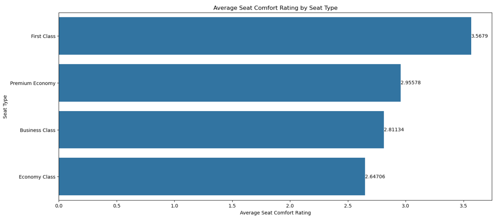

# Sentiment Analysis (British Airways Data Science Project Part 1)

## Introduction
This is Part 1 of a project from the [British Airways Data Science micro-internship](https://www.theforage.com/simulations/british-airways/data-science-yqoz). British Airways is the flag carrier airline of the United Kingdom and is the second largest UK based carrier based on fleet size and passengers. British Airways has merged with Iberia, Spain's flag carrier airline, creating the International Airlines Group.

In this task, I take on the role of a junior data scientist employed at British Airways. British Airways has tasked me with collecting customer feedback and reviewing data from a third party source. I am also tasked with creating a predictive model to help determine which customers will book a flight for the upcoming holidays. **In this part of the project, I will collect customer feedback from a third party source, conduct data analysis and sentiment analysis, and present my insights on a PowerPoint slide.**

## Problem Statement
**The team leader of British Airway's data science team wants to gain a better understanding on how customers feel about their experience.** To get customer feedback on British Airway's services, I will need to visit Skytrax and scrape the website for customer reviews. The team leader wants to focus on reviews specifically about the airline itself. **Once customer reviews are scraped from the website, I must analyze the data and report any insights I discover. My insights will be used in a board meeting, so I must summarize my discoveries on a single PowerPoint slide.**

## Skills Demonstrated
* Jupyter Notebook
* Python
* Exploratory Data Analysis
* Data Visualization
* PowerPoint

## Data Sourcing
This data I will be using in this project is scraped from [British Airways reviews provided by Skytrax](https://www.airlinequality.com/airline-reviews/british-airways). A copy of the cleaned scraped data is included in this repository under the file name: Clean_Review_Scraping.

## Data Attributes
Data analysis is conducted on cleaned scraped data. The attributes listed below are attributes from the cleaned scaped data.
* Rating - The overall rating the reviewer gave for their experience. The rating goes from 1 to 10.
* Title - The title of the review.
* Text - The main body of the review.
* Traveller - The name of the reviewer.
* Seat_Type - The seat type (economy, first class, etc.) the reviewer has paid for.
* Seat_Comfort - The seat comfort rating based on number of stars.
* Cabin_Staff_Service - The cabin service rating based on number of stars.
* Foods_&_Drinks - The foods and drinks rating based on number of stars.
* Ground_Service - The ground service rating based on number of stars.
* Value_for_Money - The value for the money rating based on number of stars.
* Recommended - Whether the reviewer recommends British Airway's service.
* Year_Flown - The year the reviewer has flown.

## Web Scraping, Data Analysis, and Data Visualizations
**Web scraping is the process of downloading a web page (a process that web browsers use when displaying a web page) and extracting data from the downloaded web page. The extracted data is then saved in a database or spreadsheet for later retrieval or analysis.**
A copy of this analysis is included in this repository under the file name: James Weber Web Scraping Analysis.ipynb.

### 1. Importing Libraries
First we will import libraries that contain the commands we need for webscraping and data analysis.

```
# Setting up libraries.

from bs4 import BeautifulSoup
import requests
import pandas as pd
import seaborn as sns
import matplotlib.pyplot as plt
```

### 2. Web Scraping Test
**When a web page is scraped, it comes in the form of all HTML codes that make up the web page. To extract data, we must first find the set of HTML codes that contains the data we want.** We will scrape the first page of Skytrax reviews to find the set of HTML code that contains the review data.

```
# Use the requests.get() command to fetch (download) the webpage.
# Use the .text command to convert the HTML code into text form.
# Use the BeautifulSoup() command to parse the HTML code.

website = 'https://www.airlinequality.com/airline-reviews/british-airways'
result = requests.get(website)
content = result.text
soup = BeautifulSoup(content)
```

Analyzing the HTML code will show that **all reviews are under the "article" tag and "review" itemprop. Since we are only interested in the contents the reviews, we will extract portions of the HTML code that contains the "article" tag and "review" itemprop.**
```
# The box contains the HTML code for each review.
# Use the find_all command to find and extract portions of the HTML code with a specified tag.

box = soup.find_all('article', itemprop = "review")
```
The picture below will show a portion of the HTML code that contains the first review on the webpage.


The portion highlighted in blue represents the tag and itemprop that the previous line of code searches for and extracts. The portion highlighted in red represents the end of the article tag. The HTML code between the blue and red portions are different attributes used to create a review.

Analyzing the HTML code, we can see the tags that make up the various aspects of a review. For example, the title of the review is under the h2 tag (highlighted in green).

### 3. Web Scraping
In the previous section, **we have extracted the HTML code that make up the reviews shown on page 1 of Skytrax's British Airway reviews.** Now that we know which tags and itemprops to extract, **we must now create a loop so that we can repeat the process for all pages.** We will use a modified url that that will display 350 reviews per page. At the time of this project, there are 12 pages of reviews, with a total of 3906 reviews.

The code below will scrape all 12 pages of reviews and will extract portions of the HTML code such as the review title, overall rating, and review text. Each portion of HTML code will be placed in a list. For example, the portion of the HTML tha make up the review's title will be placed in the title_list.
```
# Use for loops to scrape all data for all reviews.

website1 = 'https://www.airlinequality.com/airline-reviews/british-airways/page/'
website2 = '/?sortby=post_date%3ADesc&pagesize=350'
true_false = []
rating_list = []
title_list = []
author_list = []
post_date_list = []
text_list = []
aircraft_list = []
traveller_list = []
seat_list = []
route_list = []
fly_date_list = []
recommended_list = []
seat_comfort = []
staff_service = []
food_drinks = []
entertainment = []
ground_service = []
wifi = []
value = []

for page in range(1, 13):
    result = requests.get(website1 + str(page) + website2)
    content = result.text
    soup = BeautifulSoup(content)
    box = soup.find_all('article', itemprop = "review")

    for review in box:
        rating_list.append(review.find_all('span')[0].text)

        title_list.append(review.find('h2', class_ = "text_header").get_text())

        author_list.append(review.find('span', itemprop = "name").get_text())

        post_date_list.append(review.find('time').get_text())
        
        text_list.append(review.find('div', class_ = "text_content").get_text())

    for review in box:
        sub_box = review
        for i in sub_box.find_all('tr'):
            if "Aircraft" in i.get_text():
                aircraft = i.get_text().strip().replace('Aircraft', '')
                true_false.append(1)
            else:
                true_false.append(0)
    
        aircraft_list.append(aircraft if sum(true_false) == 1 else None)
            
        true_false.clear()

        for i in sub_box.find_all('tr'):
            if "Type Of Traveller" in i.get_text():
                traveller = i.get_text().strip().replace('Type Of Traveller', '')
                true_false.append(1)
            else:
                true_false.append(0)
    
        traveller_list.append(traveller if sum(true_false) == 1 else None)
            
        true_false.clear()

        for i in sub_box.find_all('tr'):
            if "Seat Type" in i.get_text():
                seat = i.get_text().strip().replace('Seat Type', '')
                true_false.append(1)
            else:
                true_false.append(0)
    
        seat_list.append(seat if sum(true_false) == 1 else None)
            
        true_false.clear()

        for i in sub_box.find_all('tr'):
            if "Route" in i.get_text():
                route = i.get_text().strip().replace('Route', '')
                true_false.append(1)
            else:
                true_false.append(0)
    
        route_list.append(route if sum(true_false) == 1 else None)
            
        true_false.clear()

        for i in sub_box.find_all('tr'):
            if "Date Flown" in i.get_text():
                fly_date = i.get_text().strip().replace('Date Flown', '')
                true_false.append(1)
            else:
                true_false.append(0)
    
        fly_date_list.append(fly_date if sum(true_false) == 1 else None)
            
        true_false.clear()

        for i in sub_box.find_all('tr'):
            if "Recommended" in i.get_text():
                recommend = i.get_text().strip().replace('Recommended', '')
                true_false.append(1)
            else:
                true_false.append(0)
    
        recommended_list.append(recommend if sum(true_false) == 1 else None)
            
        true_false.clear()

    for review in box:
        sub_box = review
        for i in sub_box.find_all('tr'):
            if "Seat Comfort" in i.get_text():
                star_rating = len(i.find_all('span', class_ = "star fill"))
                true_false.append(1)
            else:
                true_false.append(0)
            
        seat_comfort.append(star_rating if sum(true_false) == 1 else None)
            
        true_false.clear()

        for i in sub_box.find_all('tr'):
            if "Cabin Staff Service" in i.get_text():
                star_rating = len(i.find_all('span', class_ = "star fill"))
                true_false.append(1)
            else:
                true_false.append(0)
            
        staff_service.append(star_rating if sum(true_false) == 1 else None)
            
        true_false.clear()

        for i in sub_box.find_all('tr'):
            if "Food & Beverages" in i.get_text():
                star_rating = len(i.find_all('span', class_ = "star fill"))
                true_false.append(1)
            else:
                true_false.append(0)
            
        food_drinks.append(star_rating if sum(true_false) == 1 else None)
            
        true_false.clear()

        for i in sub_box.find_all('tr'):
            if "Inflight Entertainment" in i.get_text():
                star_rating = len(i.find_all('span', class_ = "star fill"))
                true_false.append(1)
            else:
                true_false.append(0)
            
        entertainment.append(star_rating if sum(true_false) == 1 else None)
            
        true_false.clear()

        for i in sub_box.find_all('tr'):
            if "Ground Service" in i.get_text():
                star_rating = len(i.find_all('span', class_ = "star fill"))
                true_false.append(1)
            else:
                true_false.append(0)

        ground_service.append(star_rating if sum(true_false) == 1 else None)

        true_false.clear()

        for i in sub_box.find_all('tr'):
            if "Wifi & Connectivity" in i.get_text():
                star_rating = len(i.find_all('span', class_ = "star fill"))
                true_false.append(1)
            else:
                true_false.append(0)
            
        wifi.append(star_rating if sum(true_false) == 1 else None)

        true_false.clear()

        for i in sub_box.find_all('tr'):
            if "Value For Money" in i.get_text():
                star_rating = len(i.find_all('span', class_ = "star fill"))
                true_false.append(1)
            else:
                true_false.append(0)

        value.append(star_rating if sum(true_false) == 1 else None)

        true_false.clear()
        
rating_list = [rating if rating.isdigit() else None for rating in rating_list]
```

Once the web pages are scraped and the lists are made, we will create a dataframe with the lists. The code below will take the lists created in the previous section of code and will create one column for each list.
```
# Create a dataframe that contains all the data for all reviews.

df = pd.DataFrame()
df['Rating'] = rating_list
df['Title'] = title_list
df['Author'] = author_list
df['Date_Posted'] = post_date_list
df['Text'] = text_list
df['Aircraft'] = aircraft_list
df['Traveller'] = traveller_list
df['Seat_Type'] = seat_list
df['Route'] = route_list
df['Date_Flown'] = fly_date_list
df["Seat_Comfort"] = seat_comfort
df["Cabin_Staff_Service"] = staff_service
df["Foods_&_Drinks"] = food_drinks
df["Inflight_Entertainment"] = entertainment
df["Ground_Service"] = ground_service
df["Wifi_&_Connectivity"] = wifi
df["Value_for_Money"] = value
df['Recommended'] = recommended_list
```
The picture below is a sample of the dataframe we have created.


### 4. Data Cleaning
**Data cleaning is the process of fixing or removing incorrect, corrupted, incorrectly formatted, duplicate, or incomplete data within a dataset.** Data cleaning ensures that the analysis is accuarate which will improve efficiency and decision making. Data cleaning techniques include removing unnecessary information, removing null values, and making sure that each column contains the right data type.

#### 4a. Removing Unnecessary Columns and Null Data
First, we will look at a summary of the dataframe we have created using the data we scraped.
```
# Use the .info() to find out the number of non-null count per column and the data type per column.

df.info()
```


The picture above shows a summary table of our dataframe. The table contains the column names, the number of non null values in each column, and the data type for each column. Some columns such as the Title, Author, Date_Posted, Text, Value_for_Money, and Recommended columns contain 3908 rows with non null values. Other columns contain less than 3908 rows with non null values, indicating that **some rows are missing data.**

First, **we will remove columns that contain data that are not useful for our analysis.** Columns that contain data that is not useful for our analysis are the Author column, Date_Posted column, and Route column.

**We will also remove columns where the number of non null values is less than 65% of the total number of reviews.** Columns with a large percentage of missing (null) values will negatively affect analysis. The total number of reviews is 3908 and 65% of the total is 2540. We will remove columns with less than 2540 non null values. These columns are the Aircraft column and the Wifi_&_Connectivity column.
```
# Use the .drop() command to drop columns that will not be used for this analysis.

df = df.drop(columns = ['Author', 
                        'Date_Posted', 
                        'Aircraft', 
                        'Route', 
                        'Wifi_&_Connectivity'])
```
Although we have removed columns with less than 65% non null values, we still have columns that contain null values. **One method to deal with null values is to replace null values with mean, median, or mode.** This method will only work with columns that contain numeric values. We will replace null values in the Seat_Comfort, Cabin_Staff_Service, Foods_&_Drinks, Inflight_Entertainment, and Ground_Service Columns with each column's mean values.
```
# Use the round() command to round a numeric value to the nearest integer.
# Use the .fillna() command to replace null values with another value.
# Use the .mean() command to calculate the average value.

df['Seat_Comfort'] = round(df['Seat_Comfort'].fillna(df['Seat_Comfort'].mean()))
df['Cabin_Staff_Service'] = round(df['Cabin_Staff_Service'].fillna(df['Cabin_Staff_Service'].mean()))
df['Foods_&_Drinks'] = round(df['Foods_&_Drinks'].fillna(df['Foods_&_Drinks'].mean()))
df['Inflight_Entertainment'] = round(df['Inflight_Entertainment'].fillna(df['Inflight_Entertainment'].mean()))
df['Ground_Service'] = round(df['Ground_Service'].fillna(df['Ground_Service'].mean()))
```
The remaining columns that contain null data also contain object data type. These columns are the Rating, Traveller, Seat_Type, Route, and Date_Flown columns. **We will remove the rows that contain null data in these columns.**
```
# Use the .dropna() command to drop rows with null values.
# Use the .reset_index(drop = True) command to reset the index and not include an index column.

df = df.dropna()
df = df.reset_index(drop = True)
```
Now that we have removed some columns and removed null values, the dataframe summary should reflect that.
```
# Use the .info() to find out the number of non-null count per column and the data type per column.

df.info()
```


The picture above shows a summary table of our dataframe. The dataframe contains 3126 rows for all columns. **We are left with 80% of the original data. This is a sufficient amount of data to conduct an accurate analysis.**

#### 4b. Converting Column Data Types
To perform further data cleaning procedures, **we will need to convert columns into the apporpriate data type.** The columns contain 1 of 3 data types: int64, float64, and object. Columns that contain int64 data type can only store whole numbers. Columns that contain float64 data type can only store decimal numbers. Columns that contain object data type can only store characters.

The Rating column contains object data type. Customer ratings are whole numbers from 1 to 10. **We will convert the Rating column data type into int64.** The Seat_Comfort, Cabin_Staff_Service, Foods_and_Drinks, Inflight_Entertainment, Ground_Service, and Wifi_and_Connectivity columns all contain float64 data types. These columns should contain whole numbers from 1 to 5. **We will convert these columns from float64 data type (decimal numbers) to int 64 (whole numbers).**
```
# Use the .astype() command to convert columns with numerical values into int64 data type.

df = df.astype({'Rating':'int64', 
                'Seat_Comfort':'int64', 
                'Cabin_Staff_Service':'int64', 
                'Foods_&_Drinks':'int64', 
                'Ground_Service':'int64'})
```
The Date_Flown column contains object data type and should be **converted into datetime data type. The Date_Flown column can then be split into a column for the month flown and the year flown.**
```
# Use the pd.to_datetime() command to convert Date_Posted and Date_Flown columns into date time.

df['Date_Flown'] = pd.to_datetime(df['Date_Flown'], format = '%B %Y')

# Use the .dt.month and .dt.year commands to extract month and year data from datetime data.

df['Month_Flown'] = df['Date_Flown'].dt.month
df['Year_Flown'] = df['Date_Flown'].dt.year

# Use the drop() command to delete a column.

df = df.drop('Date_Flown', axis = 1)
```

#### 4c. Removing Verification Notification from Review Text
Many reviews begin with ✅ Trip Verified. **The trip verification notifications are not important for our analysis and will be removed from the text.** Reviews with a trip verification notification separate the verification from the rest of the review with |. The | character acts as a delimiter. We can separate the notification from the text using the delimeter. Once the notification is separated from the text, we will delete the notifications.
```
# Use the .str.replace() command to replace the verification notifications and the delimiter with a blank space.

df['Text'] = df['Text'].str.replace("✅ Trip Verified", '')
df['Text'] = df['Text'].str.replace("✅ Verified Review", '')
df['Text'] = df['Text'].str.replace("Not Verified", '')
df['Text'] = df['Text'].str.replace("❎ Unverified", '')
df['Text'] = df['Text'].str.replace("❎ Not Verified", '')
df['Text'] = df['Text'].str.replace("|", '')

# Use the .str.strip() command to remove any whitespace.

df["Text"] = df["Text"].str.strip()
```


The picture above shows a summary table of our dataframe after data cleaning. The data under the Text column no longer has any verification notifications.

### 5. Data Analysis
We will conduct an analysis of the cleaned data. This will include an analysis on how different traveller types rate different aspects of their experience, sentiment analysis, and creating a word cloud.

First, we will analyze how different traveller types rate their overall experience.
```
avg_rating_order = df.groupby('Traveller')['Rating'].mean().sort_values(ascending = False).index.values

# Use the .subplots() command to create a figure and subplots (all the plots that fit in a figure).

fig, ax = plt.subplots(1, 1, figsize=(16, 7))

# Use the .barplot() command to create a bar plot.
# Use the .set() command to create a title and x and y axis labels.

sns.barplot(data = df, 
            x = 'Rating', 
            y = 'Traveller', 
            errorbar = None, 
            order = avg_rating_order).set(title = 'Average Rating by Traveller Type', 
                                         xlabel = 'Average Rating', 
                                         ylabel = 'Traveller Type')

# Use the .bar_label() command to add labels to each bar.

ax.bar_label(ax.containers[0])

plt.show()
```


The highest rating a customer can give their overall experience is 10. **The average rating for all traveller types is low.** The traveller type with the highest average rating are passengers who are travelling solo for leisure. The traveller type with the lowest average rating are passengers who are travelling for business.

One important aspect of air travel is seat comfort. **We will compare the seat comfort rating by seat type.**
```
avg_seat_comfort_order = df.groupby('Seat_Type')['Seat_Comfort'].mean().sort_values(ascending = False).index.values

fig, ax = plt.subplots(1, 1, figsize=(16, 7))


sns.barplot(data = df, 
            x = 'Seat_Comfort', 
            y = 'Seat_Type', 
            errorbar = None, 
            order = avg_seat_comfort_order).set(title = 'Average Seat Comfort Rating by Seat Type', 
                                                xlabel = 'Average Seat Comfort Rating', 
                                                ylabel= 'Seat Type')

ax.bar_label(ax.containers[0])

plt.show()
```


The First Class seating has the highest average score of 3.6 out of 5. The Economy Class seats have the lowest average score of 2.7. British Airway's travel class, from least premium to most premium are Economy, Premium Economy, Business, and First Class. The Business Class average seat comfort score is slightly above Ecomoy Class and lower than Premium Economy. **The lack of seat comfort for Business Class may be part of the reason why passengers who travel for business give their trips a low rating.**
